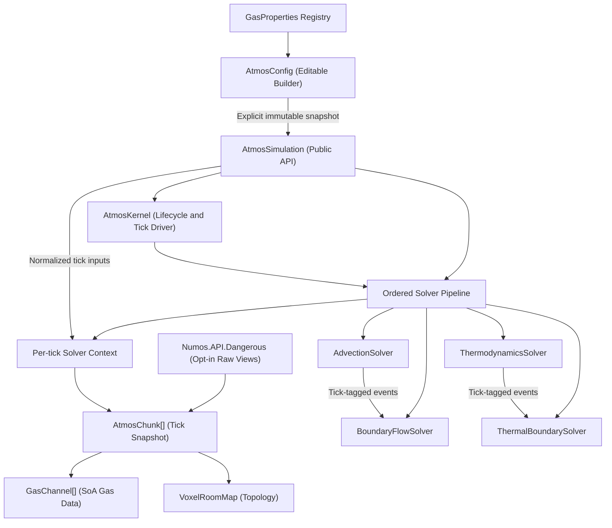

# Atmospherics System — Technical Documentation

> [!NOTE]
> Pressure, thermodynamics, phase changes, and energy transfer use the explicit SI unit model described below. Other legacy sections may not reflect every current implementation detail.

> **Revision**: 2026-09-13
> **Scope**: Engine-agnostic specification.
---

## Table of Contents

1. [Design Goals](#1-design-goals)
2. [Architecture Overview](#2-architecture-overview)
    - [Why interacting simulations share a world](#why-interacting-simulations-share-a-world)
    - [Explicit topology: portals, docks, and links beyond the grid](#explicit-topology-portals-docks-and-links-beyond-the-grid)
    - [How the Viewer presents a world](#how-the-viewer-presents-a-world)
    - [How explicit transport fits into a tick](#how-explicit-transport-fits-into-a-tick)
    - [Writing a custom solver that touches portals](#writing-a-custom-solver-that-touches-portals)
   - 2.1 [Public and Dangerous API Boundaries](#21-public-and-dangerous-api-boundaries)
3. [Data Model](#3-data-model)
   - 3.1 [Voxel Grid & Chunk](#31-voxel-grid--chunk)
   - 3.2 [Gas Channels (Structure of Arrays)](#32-gas-channels-structure-of-arrays)
   - 3.3 [Voxel Classification](#33-voxel-classification)
   - 3.4 [Gas Properties Registry](#34-gas-properties-registry)
   - 3.5 [Configuration Parameters](#35-configuration-parameters)
   - 3.6 [Container and Voxel Gas Mixtures](#36-container-and-voxel-gas-mixtures)
4. [Simulation Loop](#4-simulation-loop)
   - 4.1 [Fixed Timestep Accumulator](#41-fixed-timestep-accumulator)
   - 4.2 [Solver Pipeline](#42-solver-pipeline)
   - 4.3 [Stage 1 — Pressure Advection](#43-stage-1--pressure-advection)
   - 4.4 [Stage 2 — Cross-Chunk Boundary Flow](#44-stage-2--cross-chunk-boundary-flow)
   - 4.5 [Stages 3 and 4 — Thermodynamics and Thermal Boundaries](#45-stages-3-and-4--thermodynamics-and-thermal-boundaries)
5. [Stability & Convergence Mechanisms](#5-stability--convergence-mechanisms)
   - 5.1 [Per-Neighbor Bulk-Flow Cap](#51-per-neighbor-bulk-flow-cap)
   - 5.2 [Damping & Low-Delta Regime](#52-damping--low-delta-regime)
   - 5.3 [Minimum Pressure Transfer (Stiction)](#53-minimum-pressure-transfer-stiction)
   - 5.4 [Vacuum Cleanup](#54-vacuum-cleanup)
   - 5.5 [Delta Buffers (Ordering Scope)](#55-delta-buffers-ordering-scope)
6. [Sleep System](#6-sleep-system)
7. [Phase Changes (Condensation)](#7-phase-changes-condensation)
    - 7.1 [Clausius-Clapeyron Saturation Model](#71-clausius-clapeyron-saturation-model)
    - 7.2 [Phase-Change Internal-Energy Balance](#72-phase-change-internal-energy-balance)
8. [Networking & Replication](#8-networking--replication)
9. [Known Flaws & Limitations](#9-known-flaws--limitations)
10. [Porting Guidance](#10-porting-guidance)

---

## 1. Design Goals

The system is built to simulate atmospheric gas dynamics in the context of a space-station or sealed-environment game. The core design priorities, as observable from the code, are:

1. **Performance with auditable units.** The simulation uses the ideal-gas law `P = nRT/V` with one configurable, uniform voxel volume. Pressure is stored in pascals, temperature in kelvins, amount in moles, and sensible energy in joules. The cellular flow model remains a game-oriented approximation rather than a Navier–Stokes solver.
2. **Work-proportional cost.** CPU cycles should be spent only on regions with active pressure gradients. Stable rooms should cost effectively zero.
3. **Engine independence.** The core simulation logic has no dependency on any specific game engine, rendering framework, or platform API. It is written as a standalone module that can be dropped into any engine's update loop.
4. **Multi-gas support.** The system tracks multiple independent gas species with distinct physical properties. Memory is allocated lazily per-gas, per-chunk.

---

## 2. Architecture Overview

### Why interacting simulations share a world

`AtmosWorld` is the root of an interacting atmospheric system. It owns fixed-step time, one shared immutable physics
configuration, stable simulation registrations, and sparse topology. Each `AtmosSimulation` remains a separate storage
domain whose chunks have exactly one owner. A compatibility simulation constructor creates a private one-simulation
world, while multi-grid integrations create their simulations through a shared world.

### Explicit topology: portals, docks, and links beyond the grid

Most of a station's atmosphere is a plain 3D grid, and Numos never stores the fact that one voxel sits next to another
— ±X/±Y/±Z adjacency is implicit, computed from chunk coordinates on demand. That works because the grid is Euclidean:
given a coordinate, arithmetic tells you the neighbors.

A door between two docked ships breaks that assumption. The voxel on one side and the voxel on the other aren't
Cartesian neighbors of anything — they can be on opposite ends of the map, or in a completely different
`AtmosSimulation` with its own coordinate system. Numos calls this general case an **explicit link**: an undirected,
value-type edge between two `AtmosCellRef`s, held in a sparse overlay on `AtmosWorld` instead of being inferred from
geometry. `CreatePortal`, `CreateDock`, and `CreateLinks` are three constructors over the same edge representation —
a portal is a one-edge link set, a dock is a link set covering a whole mated surface, and `CreateLinks` is the batch
API the other two are built on. `ExplicitLinkSetKind` just records which constructor made a given batch, purely so
tooling and replay can tell a portal from a dock; it has no effect on how the edge behaves physically.

Every link carries `ExplicitLinkFlags` deciding what is allowed to cross it. `GasTransport` and `ThermalTransport` are
the two bits Numos' own built-in stages look for; the rest of that `byte` is reserved for hosts (see
[Extending portal and dock transport](#extending-portal-and-dock-transport)). A link with neither built-in bit set
still exists — it's inspectable, checkpointed, and shows up in topology enumeration — it just carries nothing through
Numos' default gas or heat solvers, which is exactly what you want for, say, a purely decorative connection or one a
custom solver owns entirely.

Creating or destroying a link is queued, not immediate: it lands at the next tick boundary, when `TopologyVersion`
advances. That's the same reason chunk registration is queued — a tick is already iterating a fixed set of chunks and
edges, and inserting one mid-traversal would make solver results depend on when exactly you called `CreatePortal`
relative to the current tick. Endpoint order is canonicalized on registration, so `CreatePortal(a, b)` and
`CreatePortal(b, a)` are the same edge, and a physical pair of cells can only be linked once — Numos rejects a second
edge between the same two voxels, and rejects a link that would duplicate an ordinary Cartesian neighbor (a portal
between two cells that are already next to each other would just be redundant plumbing). Generational simulation and
link-set IDs mean a handle to a removed portal fails loudly instead of silently reattaching to whatever reused that
storage slot next. Activating a link wakes both endpoint chunks immediately, so a pressurized room on the far side of
a portal can't hide behind a peer that happened to be asleep.

### How the Viewer presents a world

The Viewer presents every registered simulation in its own dockable 3D surface with an independent camera. One active
simulation supplies the shared 2D slice and editing panels. Its World & Topology panel creates or removes simulations,
captures two selected voxels for portals, and maps complete rectangular chunk faces into docks with quarter-turn and
axis-flip controls.

Inter-simulation connections use matching colored endpoint markers; intra-simulation connections also draw a local line.
These displays do not imply shared chunk ownership. Every chunk still belongs to exactly one simulation, and a dock
remains a sparse batch of cell links.

### How explicit transport fits into a tick

A world tick captures every simulation pipeline before running any callback, then advances every simulation through its
advection barrier, applies explicit gas transport once across the compiled world edge set, advances every simulation
through thermodynamics, and applies explicit thermal transport on the same cadence. Later stages — including any
custom ones — therefore always see the completed result of both transport passes, never a partially-applied one.
Registration order cannot decide which endpoint of a link updates first, because the explicit solver computes every
edge's request before committing any of them (the next section explains why that matters for your own solver too).

Numos simulates gas at voxel resolution. A chunk sleeps when its pressure deltas stay below the configured threshold
and wakes as a whole on mutation or boundary flow; explicit links interact with sleep the same way Cartesian boundaries
do — see [Sleep System](#6-sleep-system).

### Writing a custom solver that touches portals

If your custom stage needs to see explicit links at all, register it with `RegisterNeighborSolver` (or the `Before`/
`After` variants), not the plain `Register`. A stage registered without a selection gets an *empty* topology view —
`context.Topology.GetOwnedEdges()` silently returns nothing, and `GetNeighbors(cell)` returns no explicit neighbors —
there is no exception to tell you a portal-aware stage forgot to ask for one:

```csharp
world.Solvers.RegisterNeighborSolverAfter(
    AtmosBuiltInSolvers.Advection,
    "game/custom-portal-gas",
    new AtmosNeighborSelection(
        "game/custom-portal-gas/v1",
        includeCartesian: false,
        static link => (link.Flags & ExplicitLinkFlags.GasTransport) != 0),
    context =>
    {
        foreach (AtmosNeighborEdge edge in context.Topology.GetOwnedEdges())
        {
            // edge.First and edge.Second are the two AtmosCellRef endpoints of one portal or dock link.
        }
    });
```

`AtmosNeighborSelection` has two knobs, and picking the wrong one is the most common mistake:

- `includeCartesian` adds every ordinary ±X/±Y/±Z neighbor to the compiled view alongside explicit links. Set it to
  `false` for a solver that only ever cares about portals and docks — that's the example above, and it's what keeps
  `GetOwnedEdges()` cheap: with Cartesian adjacency excluded, the view only walks the sparse explicit edge list instead
  of every voxel in every chunk. Set it to `true` only when the same interaction genuinely needs to travel through
  ordinary walls too, like fire or sound spreading through both open doorways and portals (see
  [Use portals from a custom solver](using.md#use-portals-from-a-custom-solver) for that shape).
- The `explicitLinks` selector decides which links are "yours." Numos calls it once per link, only when topology or
  solver registration changes — never per tick — so it must be a pure function of the link's `Flags` and endpoints,
  with no captured per-tick state. This is also why `ExplicitLinkFlags` reserves bits beyond `GasTransport`/
  `ThermalTransport`: give a link a host-defined bit and your selector alone can pick it out, letting one link opt in
  or out of your interaction independently of Numos' own physics.

The selection's `Key` string is not just a label — it's checkpointed as part of that solver's registration and folded
into world state hashing, so two builds that use the same key must agree on what the selector matches. Bump the key
(`"v1"` → `"v2"`) when you change what a selection includes; reusing an old key for a semantically different selection
makes a restored checkpoint compile the wrong topology for it.

`GetOwnedEdges()` is a convenience: it re-derives current chunk membership on every call and visits each physical
adjacency exactly once, which is the right shape for a *conservative* transfer — something moved from one endpoint
must be removed from it and added to the other, exactly once, regardless of which endpoint you started from. A
performance-sensitive tiled solver should instead call `context.Topology.GetChunk(simulation, chunk)` once per chunk
and then `GetNeighbors(voxelIndex)` per voxel — an allocation-free enumerable — which avoids re-deriving chunk
membership on every voxel the way a fresh `GetOwnedEdges()` call would.

Two obligations the compiled topology does **not** enforce for you, because it only describes structural adjacency:

- **Solid and void cells still appear as neighbors.** A portal endpoint sitting in a wall or a vacuum voxel is still a
  valid edge in `GetOwnedEdges()` — Numos' own transport stages check `VoxelRoomMap` before moving anything, and a
  custom stage needs the same guard, or it will happily inject gas into a solid voxel.
- **Waking is your job.** If your stage mutates gas or heat through `Numos.API.Dangerous` (see
  [2.1](#21-public-and-dangerous-api-boundaries)), call `Wake()` on every chunk you changed. Nothing else notices a raw
  span write; a chunk that was asleep before your mutation stays marked asleep afterward unless you wake it, so its
  new pressure never gets re-evaluated.

If your stage is doing more than reading — if it moves gas or energy across a link — treat a cell with multiple
explicit neighbors the way the built-in stage does: compute every edge's request from one unchanged snapshot of the
tick's starting state, apply a single shared limiter per `(cell, gas)` pair so the sum of everything leaving a cell
this tick can never exceed what it had, and only then write the results. The built-in `explicit-gas-transport` and
`explicit-thermal-transport` stages exist specifically because a cell can have an arbitrary number of portals attached
to it (unlike a Cartesian voxel, which always has at most six neighbors), so a naive "read one edge, write it, move to
the next edge" loop lets whichever edge happens to run first drain a shared cell dry and starve every edge after it —
the result becomes dependent on edge iteration order, which is exactly the kind of order-dependence Numos'
determinism contract forbids. See [Extending portal and dock transport](#extending-portal-and-dock-transport) for how
to replace or layer on top of the built-in stages instead of writing this from scratch.

### Component Relationships



### 2.1 Public and Dangerous API Boundaries

Numos deliberately exposes two package-level integration surfaces:

| Package | Intended use | Compatibility                        | State access                                      |
|---------|--------------|--------------------------------------|---------------------------------------------------|
| `Numos.API` | Normal engine and game integration | Supported public contract            | Handles, validated operations, detached snapshots |
| `Numos.API.Dangerous` | Measured performance-critical solver code | No compatibility guarantee (for now) | Handle-addressed live spans and unchecked state views |

The dangerous package must be referenced separately and imported through `Numos.API.Dangerous`. Access begins with
`simulation.Dangerous()`. Every custom solver is registered through `simulation.World.Solvers` and receives an
`AtmosWorldSolverContext`. Most solvers use its simulations' detached snapshots and validated mutations; a measured hot
path can call `simulation.Dangerous().GetChunk(handle)` from that callback to obtain stack-scoped live chunk and
gas-channel spans.

Validated simulation mutations keep pressure/heat-capacity caches, active-voxel indices, sleep state,
and observable revisions coherent as applicable. A solver should use the dangerous package only when it must directly
traverse or mutate backing storage and can maintain those coupled invariants itself. The dangerous views are
`ref struct` values and never expose the internal `AtmosChunk` or `GasChannel` CLR types. They are safest inside a
solver callback, where the simulation already prevents concurrent tick and chunk-lifecycle operations.

---

## 3. Data Model

### 3.1 Voxel Grid & Chunk

A chunk is a 3D grid of voxels, parameterized by `Width`, `Height`, and `Depth` (a common default is 16×16×16, or 4,096 voxels).

All per-voxel data is stored in flat 1D arrays indexed by:

```
index = x + (y * Width) + (z * Width * Height)
```

The inverse mapping is:

```
x = index % Width
y = (index / Width) % Height
z = index / (Width * Height)
```

Each chunk stores:

| Array               | Type           | Description                                                                                               |
|---------------------|----------------|-----------------------------------------------------------------------------------------------------------|
| `VoxelRoomMap`      | `int[]`        | Classifies each voxel (see §3.3)                                                                          |
| `TotalPressure`     | `float[]`      | Cached pressure per voxel in pascals (Pa), recalculated at advection start and refreshed as state changes |
| `Temperature`       | `float[]`      | Temperature in kelvins (K) per voxel                                                                      |
| `TotalHeatCapacity` | `float[]`      | Cached total heat capacity per voxel, in J/K                                                              |
| `ActiveAirIndices`  | `ushort[]`     | Dense list of non-solid, non-void voxel indices in an awake chunk                                         |
| `ActiveGases`       | `GasChannel[]` | Sparse array of gas-specific mole data (see §3.2)                                                         |

For thermodynamic calculations, each gas uses an effective molar heat capacity at constant volume:

```
c_fallback = isFinite(DefaultMolarHeatCapacityAtConstantVolume) && DefaultMolarHeatCapacityAtConstantVolume > 0
    ? DefaultMolarHeatCapacityAtConstantVolume
    : 5R/2
c_effective = gasIsRegistered && isFinite(MolarHeatCapacityAtConstantVolume) && MolarHeatCapacityAtConstantVolume > 0
    ? MolarHeatCapacityAtConstantVolume
    : c_fallback
C_voxel = sum(moles[g] * c_effective[g])
E_voxel = C_voxel * effectiveTemperature
P_voxel = totalMoles * R * effectiveTemperature / VoxelVolume
```

`C_voxel` is a total heat capacity in J/K, not a molar heat capacity. `E_voxel` is the sensible internal energy represented by the voxel state, so the model uses constant-volume heat capacity (`C_v`) rather than constant-pressure heat capacity (`C_p`). `R` is the molar gas constant (`8.31446262 J/(mol·K)`) and `VoxelVolume` is in m³, making `P_voxel` pascals. `DefaultMolarHeatCapacityAtConstantVolume` defaults to the ideal-diatomic value `5R/2` (`20.786... J/(mol·K)`) and is normalized to that value if configured to a non-finite or nonpositive value. The heat-capacity cache is recalculated or updated whenever gas composition changes. When a gas-bearing voxel's stored temperature is non-finite or nonpositive, pressure and energy calculations use `DefaultTemperatureFallback`; an invalid fallback is normalized to `293.15 K`. An energy update then stores its calculated blended, diffused, or phase-change temperature.

The gas-constant value and SI relationship follow the [NIST reference constants](https://physics.nist.gov/cgi-bin/cuu/Value?r).

Chunks are identified by an `Int3 GridPosition` in a spatial map (e.g. a `ConcurrentDictionary<Int3, AtmosChunk>`).

**Active Air Optimization**: Physics loops iterate the dense `ActiveAirIndices` list rather than every voxel.
`WakeChunk` rebuilds the list by scanning all `VoxelCount` entries and retaining every non-solid, non-void voxel. The
rebuild is O (`VoxelCount`) (4,096 entries for a default 16×16×16 chunk), while subsequent physics work is proportional
to the active list.

### 3.2 Gas Channels (Structure of Arrays)

Each gas species present in a chunk is represented by a `GasChannel`:

```
struct GasChannel {
    int GasId;
    float[] Moles;  // Length = VoxelCount, rented from ArrayPool
}
```

Key properties:

- **Lazy allocation**: A `GasChannel` is only created when that gas type is first introduced to a chunk via `InjectGasToVoxel`. A chunk containing only oxygen will have one channel; a chunk containing oxygen, nitrogen, and plasma will have three.
- **ArrayPool rental**: The `Moles` array is rented from `System.Buffers.ArrayPool<float>` and cleared to zero on allocation. This avoids GC pressure from repeated allocations. The array must be explicitly returned via `Release()`.
- **Growable channel table**: `ActiveGases` begins with `AtmosChunkConstants.InitialGasChannelCapacity` slots (currently 16) and doubles only when another distinct gas ID reaches the chunk. Existing per-gas mole arrays remain untouched, preserving the structure-of-arrays solver layout while permitting arbitrary gas IDs and counts.

> [!NOTE]
> The `ArrayPool` may return an array larger than requested. Only the first `VoxelCount` entries are used. Implementations should clear only the requested range.

### 3.3 Voxel Classification

Each voxel in `VoxelRoomMap` is assigned an integer value that determines its behavior:

| Value | Constant              | Behavior                                                                                                                                     |
|-------|-----------------------|----------------------------------------------------------------------------------------------------------------------------------------------|
| `0`   | `RoomUnassigned`      | Open, pressurizable volume. Gas can exist here.                                                                                              |
| `> 0` | *(classification ID)* | Open, pressurizable volume. IDs are retained as topology metadata and do not partition solver work.                                          |
| `-1`  | `RoomVoid`            | Infinite sink / true vacuum. Gas entering this voxel is destroyed. Used for map boundaries or active vents. Pressure is always treated as 0. |
| `-2`  | `RoomSolid`           | Solid obstruction (wall/floor). Blocks gas flow completely.                                                                                  |

### 3.4 Gas Properties Registry

Each gas species is defined by a `GasProperties` struct:

| Field | Type | Purpose |
|-------|------|---------|
| `Name` | `string` | Display name |
| `MolarHeatCapacityAtConstantVolume` | `float` | Molar `C_v` in J/(mol·K). It controls sensible internal energy during injection, gas flow, thermal diffusion, and condensation. Energy and capacity paths use `DefaultMolarHeatCapacityAtConstantVolume` for missing registry entries and non-finite or nonpositive values; condensation skips unregistered gas IDs. |
| `BoilingPoint` | `float` | Normal boiling temperature (K) at `SaturationReferencePressure` |
| `CondensationEnabled` | `bool` | Enables this species in the condensation model. |
| `MolarEnthalpyOfVaporization` | `float` | Vaporization enthalpy in J/mol, used by Clausius–Clapeyron and converted to an approximate constant-volume internal-energy change for condensation. |
| `LiquidId` | `int` | Reserved integration ID. The built-in solver does not currently create liquid state or emit a condensation event. |
| `DiffusionCoefficient` | `float` | Dimensionless fraction of the per-species mole imbalance mixed per simulation tick; finite values are clamped to [0, 1], and non-finite values disable species diffusion. |

The registry is stored as a `List<GasProperties>` indexed by gas ID; zero is a valid gas ID.

### 3.5 Configuration Parameters

All tunable simulation parameters are assembled in an editable `AtmosConfig`. Construction and
`SetAtmosConfig(...)` capture an immutable `AtmosConfigSnapshot`; later mutation of the editable builder does not change
the simulation. This explicit apply boundary lets recording assign a deterministic operation sequence to each semantic
configuration change.

The literals backing these defaults are exposed through `AtmosConfigDefaults`, while immutable SI and reference
condition values are exposed through `AtmosPhysicalConstants`. Internal fixed-step scheduling values and numerical
cutoffs live in `AtmosSolverConstants`; they are deliberately not presented as runtime configuration. Default chunk
dimensions and initial chunk capacities are exposed through `AtmosChunkConstants`, while reserved room IDs have a
single definition in `VoxelClassification`.

| Parameter                                  | Default | Description                                                                                                                                                                                                                                              |
|--------------------------------------------|---------|----------------------------------------------------------------------------------------------------------------------------------------------------------------------------------------------------------------------------------------------------------|
| `GlobalTemperature`                        | 293.15  | Reference ambient temperature (K). Not actively used in the simulation loop.                                                                                                                                                                             |
| `DefaultTemperatureFallback`               | 293.15  | Starting effective temperature (K) used for pressure and sensible energy when a gas-bearing voxel stores a non-finite or nonpositive temperature. Invalid values normalize to 293.15 K.                                                                  |
| `DefaultMolarHeatCapacityAtConstantVolume` | `5R/2`  | Ideal-diatomic molar `C_v` in J/(mol·K), used for missing registry entries and non-finite or nonpositive gas heat capacities. A non-finite or nonpositive fallback value is normalized to the same value.                                                |
| `VoxelVolume`                              | 1       | Physical volume represented by each voxel (m³). Invalid values normalize to 1 m³.                                                                                                                                                                        |
| `SaturationReferencePressure`              | 101325  | Pressure (Pa) at which each gas's `BoilingPoint` applies. Invalid values normalize to one standard atmosphere.                                                                                                                                           |
| `DefaultDiffusionCoefficient`              | 0.02    | Dimensionless per-tick mixing fraction for unregistered gas IDs. Finite values are clamped to [0, 1]; non-finite values disable fallback diffusion.                                                                                                      |
| `SpaceTemperature`                         | 2.7     | Temperature of space (K). Not actively used in the simulation loop.                                                                                                                                                                                      |
| `BulkFlowCoefficient`                      | 0.25    | Dimensionless fraction of pressure delta requested as bulk flow per tick. Finite values are clamped to [0, 1]; non-finite values disable the large-delta branch.                                                                                         |
| `BulkFlowDamping`                          | 0.5     | Multiplier applied to `BulkFlowCoefficient` during large-delta advection to reduce oscillation. Finite values are clamped to [0, 1]; non-finite values disable the large-delta branch.                                                                   |
| `LowPressureDeltaThreshold`                | 5.0     | Below this pressure delta (Pa), flow uses `MaxPressureTransferFractionPerNeighbor` directly instead of `BulkFlowCoefficient * BulkFlowDamping`. Invalid or negative values normalize to zero.                                                            |
| `MinimumPressureTransfer`                  | 0.1     | Candidate pressure transfers below this magnitude (Pa/tick) are discarded ("stiction"). Invalid or negative values normalize to zero.                                                                                                                    |
| `VacuumThreshold`                          | 1.0     | Below this pressure (Pa), voxel contents are zeroed out when every neighboring air voxel is also below the threshold. Invalid or negative values normalize to zero.                                                                                      |
| `SleepThreshold`                           | 100     | Consecutive ticks below `SleepEpsilon` before a chunk goes to sleep. Negative values normalize to zero.                                                                                                                                                  |
| `SleepEpsilon`                             | 3.5     | Maximum relative pressure difference considered "at rest" (% of the higher neighboring pressure). Invalid or negative values normalize to zero.                                                                                                          |
| `ThermalConductance`                       | 0.05    | Effective per-face conductance in J/K per thermodynamics tick. Multiplying it by a temperature difference produces a candidate energy transfer, which is bounded for explicit-solver stability. Invalid or nonpositive values disable thermal diffusion. |
| `CondensationRateFactor`                   | 0.5     | Dimensionless fraction of the heat-coupled equilibrium condensation amount applied per thermodynamics tick. Finite values are clamped to [0, 1]; non-finite values disable condensation.                                                                 |
| `MaxPressureTransferFractionPerNeighbor`   | 0.16    | Maximum fraction of a voxel's pressure requested as bulk flow to one neighbor per tick. Finite values are clamped to [0, 1]; non-finite values disable bulk flow.                                                                                        |

### 3.6 Container and Voxel Gas Mixtures

`IGasMixture` provides one public interaction model for portable containers and individual voxels while preserving
the solver's structure-of-arrays layout:

- `AtmosSimulation.CreateGasMixture(volume, temperature)` returns a concrete `GasMixture` with independent sparse
  storage. Its `Volume` can be changed, and it is suitable for canisters, tanks, pipes, pumps, or temporary parcels.
- `AtmosSimulation.GetVoxelGasMixture(...)` returns an `IGasMixture` capability over one live voxel. It does not
  contain or expose spans, gas-channel arrays, or references into pooled solver memory.
- Every mixture retains its owning `AtmosSimulation`. Transfers require both endpoints to have the same owner, so gas
  IDs and molar heat capacities are interpreted through one applied configuration snapshot.
- `IGasMixture` is a common capability surface rather than an extension point. Transfer endpoints must be mixtures
  created by `AtmosSimulation`; external implementations are rejected before either endpoint changes.
- A voxel capability records the chunk generation at creation. Removing and recreating a chunk at the same position
  makes the old capability stale instead of silently retargeting it to unrelated state.
- Voxel reads and mutations enter the simulation state lock. Multi-endpoint transfers capture and validate both
  results before committing, preventing simulation ticks from observing a half-applied transfer.
- Solid and void voxels can be inspected but reject mutation. Disposing the owner invalidates both container and
  voxel mixtures.

Application code identifies gases by their registered names. Injection and mixture mutation reject unregistered gases;
the numeric overloads also validate registry membership. Names resolve against the owner's current configuration, while
snapshots and replay retain numeric IDs. The example below assumes `"Oxygen"` has been registered.

The common surface exposes volume, temperature, pressure, total moles, sparse gas lookup, snapshots, proportional
removal, and transfer operations. `SetMoles` and `AdjustMoles` intentionally preserve the stored temperature for
low-level tooling parity. `AddGas` and transfers instead conserve sensible internal energy using each gas's effective
constant-volume molar heat capacity. Pressure is always derived from `P = nRT/V` rather than being independently
mutable.

The `Temperature` setter stores its raw value for parity with direct voxel tooling. Non-finite and nonpositive stored
temperatures are interpreted through `DefaultTemperatureFallback` when pressure or sensible energy is calculated.
Creation and incoming-gas operations still require finite, nonnegative temperatures.

At the start of each simulation tick, the solver captures normalized inputs from the current immutable
`AtmosConfigSnapshot`. Built-in stages use those normalized values for the whole tick. Custom callbacks receive the live
`AtmosSimulation`; applying a new editable config from a callback updates `simulation.Config` immediately and affects
normalized built-in settings on the next tick. Solver-originated applications are deterministic internal work and are
not logged as external operations.

Call `StartRecording()` to begin an operation interval. `SetAtmosConfig(...)` records a
`SetAtmosConfigOperation` only when the applied semantic snapshot changes. `CaptureRecording()` reads the interval
without stopping it, and `StopRecording()` returns its detached operations. Each operation carries the completed Numos
tick and a monotonically increasing operation sequence. See [Deterministic replay state model](deterministic_replay.md).

Persistent voxel state and advection work buffers use single precision. Overflow-prone formulas use stable algebraic
forms: thermal equilibrium conductance is evaluated without forming `C1 * C2`, heat-capacity-weighted mixing uses
bounded interpolation, and condensation computes the temperature increment without subtracting large sensible-energy
terms. Thermal diffusion alone accumulates conductance and equal-and-opposite energy deltas in `double`; temperatures,
pressures, heat capacities, and gas inventories remain `float`. This prevents a representable temperature result from
being lost when an intermediate `C * ΔT` exceeds the `float` range.

```csharp
var canister = simulation.CreateGasMixture(volume: 0.07f, temperature: 293.15f);
canister.AddGas("Oxygen", moles: 2f, temperature: 293.15f);

IGasMixture voxel = simulation.GetVoxelGasMixture(chunk, x: 4, y: 3, z: 0);
float moved = canister.TransferTo(voxel, moles: 0.5f);
GasMixture sample = voxel.RemoveRatio(0.1f);
```

The API follows the useful container semantics of
[SS14's `GasMixture`](https://github.com/space-wizards/space-station-14/blob/master/Content.Shared/Atmos/GasMixture.cs)
while replacing its globally sized per-mixture gas array with sparse container storage and locked SoA voxel access.

---

## 4. Simulation Loop

### 4.1 Fixed Timestep Accumulator

The simulation runs on a fixed timestep, decoupled from the rendering frame rate:

```
SimulationRate = 20.0 Hz
FixedDt = 1 / SimulationRate = 0.05 seconds
MaxStepsPerFrame = 5
```

Each frame:
1. `elapsedSeconds` is added to an accumulator.
2. The accumulator is clamped to `FixedDt * MaxStepsPerFrame` to prevent a "spiral of death" when frame rate drops.
3. While the accumulator ≥ `FixedDt`, a simulation tick is consumed.

### 4.2 Solver Pipeline

`AtmosWorld` owns pipeline execution and `AtmosKernel` owns each simulation's chunk lifecycle and tick-local solver
context. Physics remains implemented by focused components under `Numos.CoreSim.Solvers`. A world tick snapshots the
enabled world stages, then each registration executes once with all simulations at the same tick boundary.

The default pipeline has seven stages, each an ordinary registered stage that a host can independently disable,
reorder, or replace:

| Stage                        | Work performed                                                                                                             |
|------------------------------|----------------------------------------------------------------------------------------------------------------------------|
| `advection`                  | Intra-chunk gas advection                                                                                                  |
| `explicit-gas-transport`     | Sparse gas transport across explicit links flagged `GasTransport`                                                          |
| `boundary-flow`              | Cartesian gas transport across ordinary chunk boundaries                                                                   |
| `thermodynamics`             | Intra-chunk thermal diffusion and phase changes                                                                            |
| `explicit-thermal-transport` | Sparse thermal transport across explicit links flagged `ThermalTransport`, on the same reduced cadence as `thermodynamics` |
| `thermal-boundary`           | Cartesian thermal transport across ordinary chunk boundaries                                                               |
| `gas-reactions`              | Per-cell configured gas reactions                                                                                          |

The relative order of these seven stages is what the default pipeline ships with, not a numerical requirement — a
host is free to reorder, disable, or unregister any of them. Because `explicit-gas-transport` and
`explicit-thermal-transport` are ordinary stages rather than a side effect of `advection`/`thermodynamics`, a host
can disable Numos' own portal/dock physics without touching intra-chunk advection or boundary flow at all, and
register a replacement in its place. See [Extending portal and dock transport](#extending-portal-and-dock-transport)
below.

Stages can be enabled, disabled, removed, or restored with `ResetToDefaults`. Custom delegates can be appended or
inserted before or after any registered stage:

```csharp
simulation.World.Solvers.RegisterAfter(AtmosBuiltInSolvers.Advection, "game-reactions", context =>
{
    AtmosSimulation simulation = context.Simulations[0];
    foreach (AtmosChunkHandle chunk in simulation.GetChunkHandles())
    {
        AtmosChunkSnapshot snapshot = simulation.GetChunkSnapshot(chunk);
        // Inspect the detached snapshot and apply results through validated simulation methods.
    }
});

simulation.World.Solvers.SetEnabled(AtmosBuiltInSolvers.Thermodynamics, false);
```

Pipeline edits made by a callback take effect on the next tick. The built-in domains retain their internal boundary
queues and producer/consumer ordering, but that implementation detail is not a public stage boundary. Recursive
`Tick`/`Update`, simulation disposal, and chunk registration/removal are rejected during a callback because they would
invalidate the current chunk snapshot. Perform those lifecycle operations outside the solver tick.

Custom stages share typed dependencies through `simulation.GetOrCreateSolverData<T>(key, factory)`, backed by the same
storage mechanism. Slots use ordinal string keys or object identity and survive ticks and pipeline edits. Restore
discards these transient values, so stages must reacquire them on each callback. Shared data does not schedule stages;
producers and consumers still need explicit pipeline ordering.
See [sharing dependencies](using.md#sharing-dependencies-between-solvers)
for examples, ownership, and threading requirements.

Solver-specific settings should remain with a stateful solver object instead of expanding `AtmosConfig` with unrelated
game configuration. Register its method as the callback:

```csharp
public sealed class ReactionSolverConfig
{
    public float Rate { get; set; } = 0.25f;
}

public sealed class ReactionSolver
{
    public ReactionSolverConfig Config { get; } = new();

    public void Solve(AtmosWorldSolverContext context)
    {
        AtmosSimulation simulation = context.Simulations[0];
        // Read snapshots and apply validated mutations through simulation.
    }
}

var reactionSolver = new ReactionSolver();

simulation.World.Solvers.RegisterAfter(
    AtmosBuiltInSolvers.Advection,
    "game-reactions",
    reactionSolver.Solve);

reactionSolver.Config.Rate = 0.5f;
```

The registered method retains the solver instance, so its typed configuration remains editable after registration.
The pipeline does not own or dispose custom solvers; callers remain responsible for an `IDisposable` solver's lifetime.

#### Extending portal and dock transport

`explicit-gas-transport` and `explicit-thermal-transport` are Numos' default implementation of transport across
explicit links (portals, docks, and arbitrary `CreateLinks` batches) — they are not a special case the pipeline
hardcodes. A host can replace them the same way it would replace any other stage:

```csharp
// Disable Numos' own portal/dock gas physics world-wide. Advection and boundary flow keep running unaffected.
simulation.World.Solvers.SetEnabled(AtmosBuiltInSolvers.ExplicitGasTransport, false);

simulation.World.Solvers.RegisterNeighborSolver(
    "custom-portal-gas",
    new AtmosNeighborSelection(
        "game/custom-portal-gas/v1",
        includeCartesian: false, // this solver only ever cares about explicit links, not ordinary walls
        static link => (link.Flags & ExplicitLinkFlags.GasTransport) != 0),
    context =>
    {
        foreach (AtmosNeighborEdge edge in context.Topology.GetOwnedEdges())
        {
            AtmosDangerousChunk first = context.Dangerous().GetChunk(edge.First);
            AtmosDangerousChunk second = context.Dangerous().GetChunk(edge.Second);
            // Read and mutate both endpoints directly to implement custom valve, filter, or reaction behavior.
            // Remember to skip solid/void endpoints and call Wake() on anything you change — see
            // "Writing a custom solver that touches portals" above for why the compiled topology doesn't do
            // either of those for you, and why a cell with several portals needs a shared per-tick limiter.
        }
    });
```

Using `AtmosNeighborSelection.All(...)` here instead would work too, but it also compiles in every ordinary Cartesian
edge and makes `GetOwnedEdges()` walk all six directions of every voxel in every chunk just to discard them with a
`Kind != Explicit` check. `All` is for a solver that genuinely wants both kinds of adjacency, like the fire-spread
example in [using.md](using.md#use-portals-from-a-custom-solver); a portal-only stage should filter with
`includeCartesian: false` instead.

`ExplicitLinkFlags` reserves `GasTransport` and `ThermalTransport` for Numos' own stages, but a `[Flags] byte` has
six more bits available. A link can carry a host-defined bit — `(ExplicitLinkFlags)(1 << 2)`, for example — purely
so a host-registered `AtmosExplicitLinkSelector` can pick it out. Numos' built-in stages only ever look at the bits
they know about, so a link can:

- mix a built-in capability with a host-defined one (default gas physics plus a custom effect layered on top with
  `RegisterAfter`),
- use only a host-defined bit to opt out of default physics entirely for that one link while every other portal
  keeps using Numos' implementation, or
- disable a built-in stage world-wide (as above) and implement every portal's physics from scratch.

This makes portal and dock transport a genuine extension point rather than a fixed behavior: a host is never stuck
choosing between Numos' bulk-pressure model and no transport at all.

#### Chunk-owned solver arrays

Solvers can keep private arrays on each chunk and let Numos roll their state back automatically. Every request must
choose `captureForRollback`: `true` includes the array in snapshots, checkpoints, restoration, and state hashes;
`false` keeps it as transient scratch storage.

`GetOrCreateChunkSolverArray<T>(chunk, key, captureForRollback, length)` allocates a regular array on first use and
returns it on later calls. Omitting `length` allocates one element per voxel; an explicit length can be any nonnegative
size. `GetOrCreateChunkSolverFlatArray<T>(chunk, key, captureForRollback)` wraps the same storage with the chunk's
dimensions. A key's element type, length, and capture policy must match on every request.

Captured fields require a nonempty string key, unique to the solver field, such as `fire/burn-count`. Strings use
ordinal equality, so a compatible solver can reacquire restored data in another simulation without sharing the original
key object. Transient fields can also use retained object keys, which compare by reference identity.

```csharp
simulation.World.Solvers.Register("fire-v1", context =>
{
    AtmosSimulation simulation = context.Simulations[0];
    foreach (var chunk in simulation.GetChunkHandles())
    {
        var exposure = simulation.GetOrCreateChunkSolverFlatArray<float>(
            chunk, "fire/exposure", captureForRollback: true);
        exposure[new Int3(0, 0, 0)] += 1f;

        float[] scratch = simulation.GetOrCreateChunkSolverArray<float>(
            chunk, "fire/scratch", captureForRollback: false);
        Array.Clear(scratch);
    }
});
```

Arrays start with default values and retain their contents across ticks, sleep, and solver removal. On rollback, Numos
replaces the chunks and restores captured arrays from independent checkpoint copies. Reacquire arrays each callback: old
references still point to the old chunk's storage. Fields first created after the checkpoint disappear; requesting them
again allocates default values. Transient fields also start fresh after restore.

Captured elements must contain no managed references. Numeric types, enums, and reference-free custom structs work;
reference types and structs containing references are rejected before allocation. Numos copies the full value state
without user-provided cloning code. Hashes include field names, element types, lengths, and exact value bytes. Keep
custom struct layout, padding, and runtime byte order consistent between compatible solvers.

Lookup and allocation through the facade are serialized with ticks. Array reads and writes are the solver's
responsibility; fetch buffers before dispatching parallel work and give each worker exclusive access to its chunk.
Storage does not alias built-in physical fields or wake chunks. Live array writes cannot advance chunk revisions, so
conditional snapshot requests including `AtmosChunkSnapshotFields.SolverArrays` copy captured fields every time.
Requests for physical fields alone retain the usual revision check. Snapshot entries expose `CopyValues<T>()` for
inspection without allowing changes to the saved state.

Initialize captured state before the starting checkpoint and make later changes inside deterministic solver callbacks.
Direct array writes are not external recorded operations; checkpoints save them, and replay regenerates solver writes.

Solvers that have a measured need to avoid copies of physical fields can opt into live storage from the same callback:

```csharp
simulation.World.Solvers.RegisterAfter(AtmosBuiltInSolvers.Advection, "fast-reaction", context =>
{
    AtmosSimulation simulation = context.Simulations[0];
    foreach (AtmosChunkHandle handle in simulation.GetChunkHandles())
    {
        AtmosDangerousChunk chunk = simulation.Dangerous().GetChunk(handle);
        Span<float> oxygen = chunk.GetGasChannel(0).Moles;
        // Raw writes are unchecked. Repair affected caches/topology and call MarkChanged as required.
    }
});
```

Gas injection through `AtmosSimulation.AddGasToVoxel` recalculates the target voxel's existing total SHC from its gas
composition before temperature mixing. Internal boundary flow uses the same atomic injection operation with the
normalized gas properties and pressure coefficient captured for that tick.

The advection, thermodynamics, and boundary-flow domains are described in detail below; their internal solver phases
remain ordered as shown where relevant. Explicit-link transport across portals and docks is covered separately in
[Extending portal and dock transport](#extending-portal-and-dock-transport) above, and gas reactions are documented at
the pipeline-stage level only — see `AtmosBuiltInSolvers.GasReactions`.

### 4.3 Stage 1 — Pressure Advection

This is the core fluid dynamics step. When the awake chunk count is smaller than the worker count, it builds one work
list across those chunks and runs ordered parallel phases. Voxel work is split into tiles of 64 active indices, so one
dense chunk can occupy several workers. Species transfer is split by `(chunk, gas)`, which gives one worker exclusive
ownership of each gas-major delta row.

When there are already enough awake chunks to occupy every worker, the solver runs the same phases sequentially inside
each chunk and assigns whole chunks to workers. This avoids global barriers and lets a worker return a chunk's scratch
buffers before taking another chunk. Both schedules use the same source, direction, gas, and reduction order, so the
choice does not change simulation results.

Each phase finishes before the next begins:

1. **Refresh voxel state and topology.** Every tile rebuilds pressure, total moles, heat capacity, capacitance, and its
   six fixed neighbor slots. Solid directions stay empty; void directions are marked as sinks. Fixed slots preserve the
   order `-X, +X, -Y, +Y, -Z, +Z` even when some directions are unavailable.
2. **Compute and gather conductance.** A source tile writes six directed edge slots indexed by voxel and direction. A
   second phase lets each destination tile gather its own edge and the opposite edge of each active neighbor in fixed
   direction order. The gather avoids concurrent additions to a shared voxel.
3. **Compute bulk-flow fractions.** Tiles calculate outward pressure transfer with the configured damping, cutoff,
   per-neighbor cap, and conductance limiter. They also record the maximum relative bulk pressure difference used by the
   sleep system.
4. **Accumulate bulk transfer.** Each `(chunk, gas)` job walks source voxels and fixed directions in ascending order,
   writing only that gas's mole and sensible-energy rows. Transfers into void have a source delta and no destination
   delta.
5. **Apply bulk deltas.** Each voxel tile owns all persistent writes for its voxels. It reduces per-gas energy rows in
   gas order, updates composition, heat capacity, temperature, and pressure, then prepares diffusion factors from this
   post-bulk state. The chunk's sleep decision uses the bulk pressure delta before diffusion starts.
6. **Accumulate diffusion.** A gas job distributes
   `DiffusionCoefficient * environmentFactor * sourceMoles * FixedTimeStep` to valid neighbors, capped at one seventh of
   the source inventory. The environment factor scales with temperature, inverse pressure, and voxel edge length. Tiny
   transfers into an air voxel are suppressed when both the existing and transferred amounts remain below
   `MinimumTrackedMoles`; transfers into void are lost.
7. **Apply diffusion and publish boundaries.** Voxel tiles apply the second delta set with the same energy reduction.
   Boundary events are then published in parallel by chunk. `BoundaryFlowSolver` sorts them by chunk and voxel before
   applying any cross-chunk flow, so queue insertion order is not observable simulation state.

Bulk application must remain before diffusion because diffusion reads the pressure, composition, and temperature that
bulk flow produced. Likewise, no delta row may be reused until its apply phase has completed.

### 4.4 Stage 2 — Cross-Chunk Boundary Flow

Boundary events are collected into a `ConcurrentQueue` during the parallel advection phase, then processed **sequentially** afterward.

For each boundary event:
1. Determine the source voxel's coordinates.
2. For each of the 6 directions, check if the neighbor coordinate is outside the chunk bounds.
3. If outside: look up the neighboring chunk at `GridPosition + direction`.
4. Map the out-of-bounds coordinate into the neighbor's local space using modular arithmetic: `nX = (targetX + neighborWidth) % neighborWidth`.
5. If the neighbor voxel is solid, skip.
6. Calculate any outward bulk pressure transfer with the same limiter used by intra-chunk advection, including damping, the low-delta branch, minimum-transfer cutoff, and the per-neighbor cap. A sleeping target is woken only if a positive mole transfer will actually be injected.
7. For each source species, combine bulk advection with the same positive partial-pressure diffusion term used inside a chunk. Diffusion is evaluated even when bulk flow is zero or points in the opposite direction:
   ```
   molesAdvected = (flow * VoxelVolume / (R * sourceEffectiveTemperature)) * moleFraction
   deltaN = sourceMoles - neighborMoles * (neighborEffectiveTemperature / sourceEffectiveTemperature)
   molesDiffused = DiffusionCoefficient > 0 ? max(0, deltaN * DiffusionCoefficient) : 0
   molesMoved = min(sourceMoles, molesAdvected + molesDiffused)
   ```
   For a void target, neighbor moles and temperature are treated as zero. An unregistered gas uses `DefaultDiffusionCoefficient`.
8. Transfer the capped moles directly (no delta buffer — this is sequential).

Each species carries `molesMoved * c_effective * sourceEffectiveTemperature` of sensible energy during the direct transfer. The source and target heat-capacity caches, temperatures, and pressures are updated immediately by energy balance. Before injection, the target voxel's existing heat capacity is recalculated from its current moles and the normalized gas registry captured for the tick, including for a target chunk that was sleeping before the transfer.

If the adjacent chunk is not registered or the mapped target is solid, no transfer occurs. A non-void target room is
woken before it receives gas. Any source that moves gas is also kept awake with its sleep timer reset, because the
intra-chunk sleep scan cannot observe a cross-chunk gradient. A void target is an energy sink: transferred moles and
their carried energy are removed from the source without being added to a target voxel.

### 4.5 Stages 3 and 4 — Thermodynamics and Thermal Boundaries

Thermodynamics runs at half frequency (every 2nd tick) to save computation. Execution order is:

1. In parallel for each awake chunk, solve intra-chunk thermal diffusion and queue thermal-boundary events.
2. Still within that per-chunk pass, process phase changes using the post-diffusion voxel state.
3. After all parallel chunk work completes, deduplicate cross-chunk faces and solve them from one immutable boundary snapshot. Boundary handling recalculates current pressure, heat capacity, and effective temperature, so it uses post-phase-change state.

**Intra-Chunk Thermal Diffusion**: Adjacent non-vacuum voxels exchange energy according to their temperature difference and total heat capacities. Intra-chunk diffusion uses a two-pass solve from one immutable temperature and heat-capacity snapshot. Each undirected edge `(i, j)` is visited once, and its pair conductance is:

```
g_ij = min(ThermalConductance, C_i * C_j / (C_i + C_j))
G_i = sum(g_ij for every edge incident to i)
s_ij = min(1, C_i / G_i, C_j / G_j)
Q_ij = s_ij * g_ij * (T_i - T_j)
```

The first pass accumulates each voxel's incident conductance `G`; the second recomputes the same edges and buffers
equal-and-opposite energy deltas. Conductance sums and energy deltas use double-precision work storage to avoid
intermediate overflow, while the persistent result remains single precision. The symmetric scale ensures the total
applied conductance at either endpoint cannot exceed that endpoint's heat capacity, so each result is a convex
combination of the snapshot temperatures. This removes traversal-direction bias, conserves energy, and prevents new
temperature extrema. Voxels with zero heat capacity do not participate and retain their stored temperature.

**Phase Changes (Condensation)**: See §8. These run after intra-chunk thermal temperatures have been applied and before thermal-boundary events are drained.

**Cross-Chunk Thermal Diffusion**: Boundary faces are deduplicated, their post-phase-change temperatures and heat
capacities are snapshotted, and the same `g`, `G`, `s`, and `Q` equations are applied across the entire boundary set.
Equal-and-opposite energy deltas are buffered before any boundary temperature is written, eliminating concurrent-queue
traversal bias. Solid, void, and vacuum-classified voxels do not conduct, and a missing adjacent chunk receives no heat.
Depth-one chunks do not conduct through their Z faces. Thermal transfer can update a sleeping neighbor without waking
it.

---

## 5. Stability & Convergence Mechanisms

The advection loop is a first-order explicit cellular automaton, which is inherently prone to oscillation ("ringing") if flow per tick exceeds stability limits. The system employs several interlocking mechanisms to ensure convergence.

### 5.1 Per-Neighbor Bulk-Flow Cap

The per-neighbor cap limits the bulk pressure-transfer candidate from a source voxel to one neighbor:

```
bulkFlowPerNeighbor ≤ currentPressure * MaxPressureTransferFractionPerNeighbor
```

With the default `MaxPressureTransferFractionPerNeighbor = 0.16 ≈ 1/6`, the six bulk-flow candidates in a 3D neighborhood total at most about 96% of the source pressure. This is a local inventory/stability heuristic, not a formal CFL number because the model does not track wave speed or cell length. The bound applies only to bulk advection: the Fickian term is added afterward and can make the combined requested species outflow exceed that amount.

A separate gas-major `scheduledOutflows` buffer provides the actual inventory protection. For each gas and source voxel, every neighbor transfer is capped to `sourceMoles - alreadyScheduledOutflow`, so aggregate scheduled outflow cannot exceed the moles present at the start of the pass. Neighbors are checked in fixed `-X`, `+X`, `-Y`, `+Y`, then (for 3D) `-Z`, `+Z` order. If requests exhaust the inventory, later directions receive only the remainder, so the safety cap can introduce directional allocation bias under saturation.

Design note: a naive bulk cap of 0.5 is unstable for more than 2 neighbors (0.5 * 6 = 3.0 > 1.0); 0.16 (≈1/6) keeps the six 3D bulk candidates below one source-pressure inventory, while `scheduledOutflows` enforces the final mole bound after diffusion is included.

### 5.2 Damping & Low-Delta Regime

Two regimes are used depending on the magnitude of the pressure delta:

- **Large delta** (`pressureDelta ≥ LowPressureDeltaThreshold`): `flow = pressureDelta * BulkFlowCoefficient * BulkFlowDamping`. The `BulkFlowDamping` (0.5) reduces the effective flow rate to kill ringing in high-energy scenarios.
- **Small delta** (`pressureDelta < LowPressureDeltaThreshold`): `flow = pressureDelta * MaxPressureTransferFractionPerNeighbor`. This bypasses the friction model and uses the configured low-delta fraction directly.

### 5.3 Minimum Pressure Transfer (Stiction)

Flows below `MinimumPressureTransfer` (0.1) are discarded entirely. This prevents infinitesimal flows from keeping a chunk awake indefinitely and accelerates convergence by eliminating micro-oscillations.

### 5.4 Vacuum Cleanup

Voxels with `TotalPressure < VacuumThreshold` (1.0) have all gas moles zeroed out only when every orthogonally adjacent
air voxel is also below the threshold. Solid walls, void voxels, and missing chunks do not prevent cleanup. The solver
classifies the complete pressure field before removing any gas, so traversal order cannot turn neighboring trace voxels
into a cascading cleanup.

This preserves a low-pressure expansion front while it remains next to pressurized gas. Once an isolated region and all
of its neighbors fall below the threshold, cleanup removes the trace gas that would otherwise keep chunks awake.

### 5.5 Delta Buffers (Ordering Scope)

Mole and sensible-energy transfers within a chunk are not applied directly during the neighbor scan. Gas-major mole
deltas are accumulated at `gasIndex * VoxelCount + voxelIndex`. Sensible-energy deltas use the same gas-major layout
with `double` elements, preventing a representable final temperature from being lost when an intermediate
`moles * C_v * temperature` exceeds the `float` range.

One `(chunk, gas)` job owns each pair of delta rows for an entire accumulation phase. Several jobs may target the same
voxel, but they write different rows. The apply phase changes ownership: a 64-entry tile owns every gas, temperature,
pressure, and heat-capacity write for its voxels. These two layouts keep workers from overwriting each other without
locks or atomics.

Floating-point order is fixed where several values meet. A gas row scans sources and directions in ascending order;
incident conductance gathers fixed direction slots; and energy rows are reduced in gas order. Parallel completion order
therefore cannot change a result. Phase barriers also keep bulk advection ahead of diffusion and prevent an apply pass
from seeing a half-written row.

All workspace arrays are rented from `ArrayPool<T>` and returned even when a phase throws.

> [!NOTE]
> Cross-chunk gas flow is deterministic but sequential and updates current state immediately, so a later boundary
> event observes earlier transfers. Cross-chunk thermal diffusion is different: it deduplicates edges, snapshots
> their states, and buffers equal-and-opposite energy deltas before applying any temperature.

---

## 6. Sleep System

Each chunk maintains a `SleepTimer` counter. After each advection pass:

1. For each neighbor pair, divide the absolute pressure difference by the higher pressure. The largest percentage in the
   chunk (`maxRelativePressureDelta`) is tracked. A gas-to-vacuum edge has a 100% difference.
2. If `maxRelativePressureDelta < SleepEpsilon` (3.5%): increment `SleepTimer`.
3. If `SleepTimer > SleepThreshold` (100): set `IsAwake = false`. The chunk ceases all processing.
4. If `maxRelativePressureDelta ≥ SleepEpsilon`: reset `SleepTimer` to 0.

A sleeping chunk is woken when:
- `InjectGasToVoxel` is called on it (the sleep timer is reset).
- A boundary flow event targets one of its voxels.

A chunk that sends gas across a boundary is kept awake and has its sleep timer reset. The sleep criterion itself is
pressure-based; scaling every pressure in a chunk by the same amount does not change its sleep decision. A temperature
gradient alone does not wake or keep a chunk active.

The sleep system is the primary mechanism for achieving the "work-proportional cost" goal. In a station with 500 chunks, only the handful with active pressure gradients consume CPU.

Unit tests confirm convergence to sleep for L-shaped, donut-shaped, and zigzag room geometries, with pressure equilibrating to within 1.0 moles of the average across all voxels.

---

## 7. Phase Changes (Condensation)

### 7.1 Clausius-Clapeyron Saturation Model

Condensation is modeled using a saturation-vapor-pressure approach based on the Clausius-Clapeyron equation:

```
T_effective = storedTemperature > 0 && isFinite(storedTemperature)
    ? storedTemperature
    : DefaultTemperatureFallback
```

`SaturationReferencePressure` defaults to one standard atmosphere (`101325 Pa`) and is the pressure at which the configured `BoilingPoint` applies.

For a registered species, phase-change processing first requires `CondensationEnabled`, more than `0.01` moles in the voxel, and a positive effective temperature. Condensation then occurs when partial pressure exceeds saturation. Let `n0` and `T0` be the initial vapor amount and temperature, `x` the candidate condensed amount, `Cv` the condensing species' effective molar heat capacity, `C_other` the heat capacity of every other gas, and `K = R / VoxelVolume`:

```
if gasIsRegistered && CondensationEnabled && gasMoles > 0.01 && T_effective > 0:
    deltaU = max(0, MolarEnthalpyOfVaporization - R * T0)
    C_after(x) = C_other + (n0 - x) * Cv
    T_after(x) = T0 + x * deltaU / C_after(x)
    P_vapor(x) = (n0 - x) * K * T_after(x)
    P_sat(x) = SaturationReferencePressure
               * exp(-(MolarEnthalpyOfVaporization / R)
                     * (1/T_after(x) - 1/T_boiling))
    solve P_vapor(x_equilibrium) = P_sat(x_equilibrium), 0 <= x_equilibrium <= n0
    molesToCondense = x_equilibrium * CondensationRateFactor
```

Dividing molar vaporization enthalpy by `R` makes the exponential dimensionless. This integrated Clausius–Clapeyron form assumes ideal vapor and approximately constant vaporization enthalpy over the modeled temperature interval. Subject to the gates above, this model allows condensation at any temperature where the gas is supersaturated rather than only below a fixed temperature. Gas IDs without a registry entry, invalid boiling points, and invalid or nonpositive vaporization enthalpies are skipped.

The equilibrium solve uses the remaining vapor amount and saturation amount in logarithmic mole space. A bounded
Newton iteration with a bisection fallback keeps the solution inside `[0, n0]`, uses double-precision intermediates,
and avoids an overflow-prone pressure round trip for large inventories. The same temperature curve is used both to
select the condensed amount and to apply its energy change, so the solve includes the warming of the remaining
vapor as well as the resulting rise in saturation pressure. The approximation and its assumptions match the
integrated ideal-vapor derivation summarized in [NISTIR 5321](https://nvlpubs.nist.gov/nistpubs/Legacy/IR/nistir5321.pdf).

### 7.2 Phase-Change Internal-Energy Balance

Condensation removes both the condensed gas's heat capacity and the sensible energy that gas carried. Clausius–Clapeyron uses vaporization enthalpy, but this is a constant-volume internal-energy balance, so the released energy per mole is approximated as `ΔU_vap = max(0, ΔH_vap - RT)`. Let `n_condensed` be the number of moles condensed and `C_after` the heat capacity recalculated from the remaining composition:

```
C_after = sum(remainingMoles[g] * c_effective[g])
if C_after > 0:
    T_after = max(0, T_effective + (n_condensed / C_after) * ΔU_vap)
```

This temperature form is the simplified constant-volume energy equation after the departing vapor's sensible energy
has canceled. It avoids computing and subtracting two potentially overflowing `T*C` terms. The temperature update is
performed only when `C_after > 0`. The voxel's cached `TotalHeatCapacity` and `TotalPressure` are updated immediately.
As elsewhere in the energy model, a non-finite or nonpositive configured `MolarHeatCapacityAtConstantVolume` uses the
normalized `DefaultMolarHeatCapacityAtConstantVolume`.

Phase-change energy generally warms the remaining gas, which raises both its partial pressure and its saturation
pressure. The coupled amount solve in §8.1 evaluates both effects before applying `CondensationRateFactor`.
Accounting for the ideal-gas `pV` term and the condensed gas's departing sensible energy avoids assigning enthalpy
directly to a constant-volume internal-energy state.

### Liquid-system integration

Condensed moles are removed from the gas channel and their energy effect is applied immediately. Numos does not
currently expose a liquid state or precipitation-event output. A game that models liquids must provide that state and
coordinate it with a custom solver.

---

## 8. Networking & Replication

The reference implementation includes stubs and data structures for network synchronization, but the networking logic itself is not implemented.

### Snapshot Replication

`AtmosChunkSnapshot` is a full-fidelity copy of a chunk's state:

```
struct AtmosChunkSnapshot {
    Int3 GridPosition;
    float[] TotalPressure;   // 4096 floats
    float[] Temperature;     // 4096 floats
    GasSnapshot[] Gases;     // Per-gas mole arrays
    int[] VoxelRoomMap;      // 4096 ints
}
```

A helper class `AtmosNetworkCompression` provides 8-bit quantization for pressure values (0–1000 range mapped to 0–255), but comments note this is unused and full float data is currently synced.

### Network Events

`GasInjectionEvent` is defined for replicating sudden gas injections (explosions, tank ruptures):

```
struct GasInjectionEvent {
    Vector3 Position;
    int GasId;
    float Moles;
    float Temperature;
}
```

The `AtmosNetworkManager` contains method stubs for:
- Sending injection events to the server.
- Server-side RPC handling (world position → chunk/voxel mapping, then `InjectGasToVoxel`).
- Client-side visual/audio response.

All networking methods are stubs with comments indicating where real implementation would go.

---

## 9. Known Flaws & Limitations

### Numerical

2. **Unidirectional flow in advection.** The advection loop only processes flow from high pressure to low (`pressureDelta > 0`). Due to the delta buffer, each voxel-pair transfer is computed from the higher-pressure side and applied after the neighbor scan.

3. **Sleep is pressure-driven.** The chunk sleep criterion observes intra-chunk pressure deltas, not temperature
gradients. Thermal diffusion can update an already participating sleeping neighbor across a boundary, but a thermal
gradient alone does not wake a chunk or keep its thermodynamics stage active.

### Performance

4. **Chunk snapshot allocation.** A direct `Tick` snapshots `_chunkMap.Values` with `.ToArray()`. `Update` performs one
snapshot for its batch of up to five fixed steps. Frequent direct ticks or updates with large chunk counts therefore
generate array-allocation pressure.

---

## 10. Porting Guidance

To implement this system in another engine or language, start from the core module described in this document:
- `AtmosSimulation` — the supported public facade.
- `AtmosKernel` — the internal lifecycle and tick driver.
- `Numos.CoreSim.Solvers` — atomic physics stages and shared solver math.
- `AtmosChunk` — the parameterized voxel grid.
- `AtmosConfig` — all tunable parameters.
- `GasChannel` and `GasProperties` — simulation data structures.
- `Types.cs` — standalone `Int3`, `Vector3`, event structs.

### What to build

| Component | Status | Action Required |
|-----------|--------|-----------------|
| Tick driver integration | ✅ Complete | Call `AtmosSimulation.Update(deltaSeconds)` from your engine's update loop. |
| Chunk lifecycle | ✅ Complete | Call `CreateAndRegisterChunk` / `UnregisterChunk`; chunks remain owned by the simulation. |
| Voxel topology | ✅ API provided | Populate topology through `SetChunkClassification` and `SetVoxelClassification`. |
| Gas source API | ✅ API provided | Use `AddGasToVoxel` for game-side sources such as pipes, vents, and fires. |
| Liquid system | ❌ Not provided | Condensation updates atmospheric state only. Build liquid state and integration if needed. |
| Visualization | ❌ Not provided | Pressure, temperature, and gas composition are available per-voxel. You must build rendering (overlays, particle effects, fog). |
| Networking | ❌ Snapshot only | `AtmosChunkSnapshot` is exposed, but serialization, transport, and client reconciliation are not implemented. |

### Parallelism

The simulation assumes parallel execution:

- **Advection** dispatches voxel tiles and gas rows across all awake chunks. A single dense chunk can therefore use
  multiple workers. Once the awake chunks already saturate the worker pool, it dispatches whole chunks to avoid extra
  barriers.
- **Thermodynamics** dispatches independent chunks in parallel.
- **Gas and thermal boundary processing** is sequential and must remain so to avoid race conditions when two chunks write to each other's voxels.
- **Boundary event production** can run in parallel because the consumer sorts events before applying cross-chunk work.

If your target platform does not support threading (e.g., single-threaded WASM), the simulation still functions
sequentially. The same phase barriers and reduction order apply at every worker count.

### Memory

At 16×16×16 with one gas:
- Per chunk: about **88 KB** for `VoxelRoomMap`, `TotalPressure`, `Temperature`, `TotalHeatCapacity`, `ActiveAirIndices`, and one `GasChannel`, excluding smaller metadata arrays and pool overhead.
- Per additional gas: +16 KB.
- 512 chunks (8×8×8 grid): about **44 MB** before pool overhead and metadata.

`ArrayPool` rental means actual memory footprint depends on pool behavior. Arrays may be larger than requested and may persist in the pool after `Release()`.
